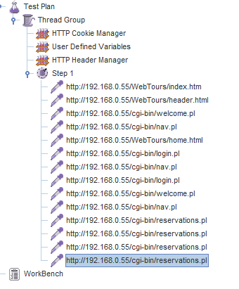

# jmeter

3층 오픈개발실 72좌석

---

### 성능테스트 왜하냐?

- 고객이 빠른 성능 요구
- 복잡한 시스템은 성능 문제점을 야기
- 신규/고도화된 앱의 성능결함은 항상 존재

---

### 부하테스트 ?

최대 한계 부하를 발생하여, 얼마까지 버티는지 측정하는 방법

---

### 성능테스트 하려면..

DB / SQL / 시스템 / 개발 다 알아야한다..

한개씩 출발해서 영역을 넓혀 가는것이 좋겠다.

나는 시스템 엔지니어니까 시스템만 쭉~ 하겠다.. 이러면 성능테스트 못함..

다른것도 할줄 알아야..

---

어디선가 병목이 발생하는데,

DB가 느리다 -> dba에게 문의
앱이 느리다 -> 개발자에게 문의

---

## 기초용어

### Transaction

성능테스트의 응답시간 측정의 업무 단위

ex) 입사지원 => (홈페이지 접속 -> 채용공고 -> 지원하기)

### Response Time

데이터를 pc에 받는시간까지는 측정 되는데, 사용자에게 띄우는 시간은 로드러너, 제이미터 둘다 못함.

### Thiink Time

응답시간 됬다가 다음화면으로 클릭하기까지 대기하는시간.

뭘 누를지 생각하는시간(?)

### Concurrent User

Concurrent User = active User + inactive(?) 유저

Named User : 해당 시스템에 접속이 가능한 사용자

### Active user

놓쳣다

### Peak Time

Request가 가장 많은 시간

Peak Time은 업무 시스템 별로 다를 수 있음.

ex) 로그인은 아침 출근시간에 많이 이루어짐.

뱅킹 : 월급일 날 트랜잭션 많이 이루어짐.

### TPS (Transaction per Second)

TPM (minute)
TPH (hour)

### TPS와 사용자의 상관관계

사용자 증가한다면? => TPS 증가 (시스템이 정상적으로 처리된다는 가정)

응답시간 증가한다면? => TPS 감소

TPS = 동시사용자(Active user + Inactive user) / 호출간격(Response Time + Think Time)

동시사용자 20명이 10초간격으로 호출함 -> 2TPS

### TPS 계산공식

### Saturation Point (포화 지점)

어느 지점부터는 병목으로 이니해 사용자가 증가하더라도 TPS가 더이상 증가하지 않는다.

이때, 사용자가 계쏙 증가하면 응답시간은 기하급수적으로 증가하게 된다.

(ppt 내용 추가 필요)

---

## 성능테스트 종류

**단위 성능 검증**

- 성능테스트의 대상이 되는 개개의 업무의 최대성능 산출과 업무별 튜닝이 목적

우리은행 목표 : 6000TPS. 보통 은행 2000~3000TPS

IBM장비로 도입을 했음. 장비 샀으니까 향후 몇년 사용자 늘어날것을 생각해서.. 향후 5년간 6000TPS로 예상하고 테스트 진행했다고 하더라고요

**통합 성능 검증**

성능테스트의 대상업무를 업무가중치와 부하 시나리오를 이용해 실제 시스템이 가동되는 상황으 재현

업무 가중치 : 업무가 4가지 있다면, 이중 사용빈도가 높은 것이 있다. 가중치를 업무마다 다르게 준다.

ex) 1000명 데리고 200명은 로그인, 300명은 이체 이런식으로...

근데 1000명 알바비가 얼마야!! jmeter로 해결 가능

**통합 성능 검증 + 배치 검증**

**임계 성능 검증**

- 도입된 자원들이 최대로 어디까지

장비 자원 100이라고 가정.

오픈해서 20 사용함 (80의 여유 있음)

시간을 가지고 쭉 모니터링함. 갑자기 80으로 올라가진 않음.

우리가 어디까지 커버 되는지 미리 측정하는거죠.

맥스를 2000TPS로 잡고 만들었는데, 오픈한지 얼마안되서 2000TPS 찍어버리면 장비를 또 사야하잖아요...ㅠ

**Aging 테스트**

통합성능검증으로 1000명 데리고 테스트 했는데 30분 측정했을 때에는 이상이 없다. 6시간동안 테스트 했을 때에도 이상없을까?

자원 반납 안하면.. 누수 일어나면 6시간 못돌림.. 자바 힙메모리 반납 안하는 누수 발견 할수 있음.

LG전자 프로젝트 하는데 CNS가 프로젝트 진행하는데 우리 프로젝트는 안정성 테스트 필요 없다. 했는데 요 문제가 일어났어요. 그래서 나중에 버그 찾아서 튜닝했다고 하더라고요. 제가 봤을 때는 Aging 테스트 하는게 좋습니다.

12시간 -> 돌려놨다가 퇴근하고 다음날 보곤 함. 12시간 앉아서 보거나 이런식으로 하진 않음.

**가용성 테스트**

장비를 1장비만 사용하지 않음. was, db 등 이중화 되있음.

한 장비 죽여도 정상처리 하는지 테스트함

ex) was 한대 죽임. was 한대 죽었다고 은행 거래안되면 뉴스뜹니다.ㅋㅋㅋ was 한대 죽여도 정상적으로 실행 되는지 테스트를 해보고 오픈 해야함.

**시스템 연동 검증**

보통 연동되는 장비들이 사양이 낮습니다. 거기에서 병목될 가능성이 많아요. 그럼 어떻게 하냐?

request하면 response 할텐데..

echo 라고 표현하기도 하는데.. request 보내면 바로 response 하는거죠.. (웹에서 가짜 mock 을 만드는 것 인것 같음)

**시스템 확장성 검증**

- WAS / 웹서버를 늘릴 때, 성능 검증

운영 대비 성능 검증

운영장비에 바로 하면 리스크가 있으니까

테스트장비에 충분한 테스트를 하여 버그 찾고 고친다

추가 업무 성능 검증

구성 변경에 따른 성능 검증

---

### Regretion(?? 회귀) 테스트

업무는 5개가 있음. 나는 1개만 개발함. 4개는 기존껄로 씀. 내가 개발한거 단위기능 검증하고 잘 됬어요. 그런데 5개를 순서대로 테스트 안해봤어요. 내꺼만 했는데 잘됬어. 그래서 잘 될줄 알았어. 근데 테스트 5개를 쭉 해야되요. 잘 되겠지..? 라고 생각하면 안됨. 5개 쭉 묶어서 돌려보는것이 회귀테스트

---

## 시나리오 정의

담당자는 언제 어느업무가 많이 쓰이는지 안다.

그래서 대상업무의 피크시간대 등 조사해서

asas시스템. -> 로그가 있어요. 로그분석기법을 이용하면 대상업무의 특징을 알 수 있다.

신규기획은 로그가 없잖아요. 10000명을 타겟으로 맞추고 이런 식으로 할거다 뭐 이런거 정해요

a~z 까지 다 테스트 할 수없다. 현식적으로 많이쓰는 80%업무와 담당자들이 추가적으로 요청한 중요한 업무들을 시나리오로 잡아서 테스트를 할 수 있습니다.

목표 기준은 크게 4가지 형태

목표 TPS, 자원사용률, 서비스유지 시간, 응답시간

ex) 우리는 1000명, 99%, 3초안에 응답, 자원 70% 사용, 12시간 안정적으로 해야한다.

점검이 잦은 회사는 안정성이 없는 회사. 안정성을 유지시키는 것도 중요합니다.

------

# Jmeter

Apache 재단 Open Source

100% Java, Multi-Threading

2001년 v1.0 공개 이후, 현재 v4.0

사용자수 제한 없음

&nbsp;

Correlation 처리. ( 로그인 세션 관련된 것인데, 잘 모르겠다.
 )

Assertion 처리.

ex) 1. 로그인 하였을때 "이름 님 환영합니다." 라고 뜨면 정상이라고 처리해라

ex) 2. 이체 할 때는 "이체가 정상적으로 되었습니다." 라고 뜨면 정상처리 해라

&nbsp;

**플러그인 다운로드**

https://jmeter-plugins.org/

현재(2018/07/20) 71개의 플러그인이 있음

&nbsp;

**실행**

압축풀고, bin/ApacheJMeter.jar 실행한다.

&nbsp;

**BadBoy**

설치하고 열어서 url 넣고

로그인을 해줌

비행기 예약한다.

정지(stop) 누르고

File - Export to JMeter 저장.

`JMeter` 열고 방금 저장한 파일을 열면

기본으로 testPlan 밑에 로그인 했던 과정 자동으로 쓰레드 그룹이 생성이 됩니다.

BadBoy 사용안하면 자기가 개발자라고 하면..

보내는 전문에 대한 내용을 알고 있을텐데 그걸 모르면 스크립트를 만들기 어렵잖아요.

개발자도구를 통해서 어떻게 가는지 다 확인해서 다 수동으로 확인해야 한다.

BadBoy를 사용하면 간단하게 스크립트를 만들 수 있다는 장점이 있습니다.

**BadBoy를 이용하여 로그인 - 항공예약 까지의 과정을 가져온 모습.**

**Thread group**

가장 먼저 해야 하는 작업.

해당되는 단위업무에 대한 리퀘스트 하나

스레드그룹은 다른 스레드그룹에 들어갈 수 없다. 병렬적으로 추가를 해야 한다.

로그인이다 : 로그인 스레드그룹이 하나 있다.

**HTTP Request Defaults**

**CSV Data set config**

테스트 데이터를 전달 하는 방법.

로그인할 경우, 아이디와 패스워드가 저장되어있는 CSV를 만들어, 읽는다.

| 가상업무 | 로그인 | 항공기 예약| 조회|
| :------------- | :-------------  |:------------- |:------------- |
| 7      | 3       | 2| 2|

7개의 계정이 있다.

로그인에 3개의 계정을 사용한다. (A,B,C) -> Unique 방식을 사용해야 한다.

2개의 계정을 항공기 예약에 사용한다.

2개의 계정은 조회에 사용한다.

3개의 계정은 로그아웃에 사용한다.

음> 로그아웃하려면 로그인을 먼저 해야하지 않나?

구성이 어떻게 되어 있냐면.

init이 있고 (1번)

**action**이 있고 (반복)

end (1번)

&nbsp;

ex) 로그인

init : 메인

action : 로그인

end : 로그아웃

로그인을 하기 위해서 메인페이지를 호출한다.

로그인에 해당되는 것은 action이다.

ex) 항공기 예약

init : 메인, 로그인

action : 항공기 예약

end : 로그아웃

ex) 조회

init : 메인, 로그인

action : 조회

end : 로그아웃

**반복적으로 하는 것을 무조건 액션에 넣어야 한다.**

업무에 대한 사전작업은 init에 들어간다.

그렇지 않으면 엄한 부하를 발생시킨다.

Sequential / Random / Unique

앱 조회다 하면 랜덤으로 하면되고

앱 주문 이면, unique겠죠.

업무 성격에 따라... 다름

조회 / 등록 / 업데이트 이 중에 조회가 가장 간단함

조회 : 중복되도 상관없음. 조회 여러번 하는 경우도 있으니까.

등록 : 중복안되게 유니크 하게 만들어야함

업데이트 : 로직을 알아야해서 개발자랑 얘기해서 해야함.

&nbsp;

쿠키...

### Reqular Expression Extractor

웹 서버에서 받아온 값을 Parsing 하여 그 내용중 의미 있는 값을 찾아내는 유용한 방법

### Logic Controller

Loop를 쓰고싶다면..

Thread Group 오른쪽 버튼 클릭 - Add - Logic Controller - Loop Controller

여러 컨트롤러가 있다.

### Timer

Think time 구현체

1) 로그인
3명이 1초에 로그인 1번 수행. 10초면 30번.

Synchronizing Timer 를 3초로 건다면..

한번 하고 쉬어. 3초때 까지...

2) 항공 예약

3명이 3초에 예약 1번 수행. 10초면 9번

저는 Synchronizing Timer 가 잘 안되서, 이거 잘 안쓰고, 헤이싱컨트롤러?? 그거써요.

기본... 너무어렵다.

제대로 수행하는지도 모르겠고

시나리오도 안열리고..ㅠ

## 테스트 계획 / 환경구축

응답시간이 느리다 -> 어디서 응답이 느린지 모른다 -> APM (Application performance management) 을 또 실행시켜야 알 수 있다. core까지는 다 나오고, db, sql까지도 나옵니다. 테스트 할 때 같이 하는게 좋습니다.
( 제니퍼나 pinpoint로 하는거같음 )
