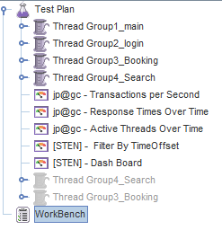

## Total_tour.jmx 불러오기

불러올 때, 같이 첨부되어있는 라이브러리를 미리 등록해야 한다.

안하면 에러뜸.

---

Group1 : main 페이지 접속.
Group2 : 로그인하기
Group3 : 예약하기
Group4 : 검색하기

아래 것들은 시각화해주는것 같은데

Response Times Over Time 의 경우, 시간에 따른 응답시간이 나온다.

실습을 하고싶은데 어떻게 하는지 모르겠따.

v2.11 과 Java8은 안맞는거 같다.

Java7 다운받는법도 있지만,

그냥 v4.0으로 해야겠다.
